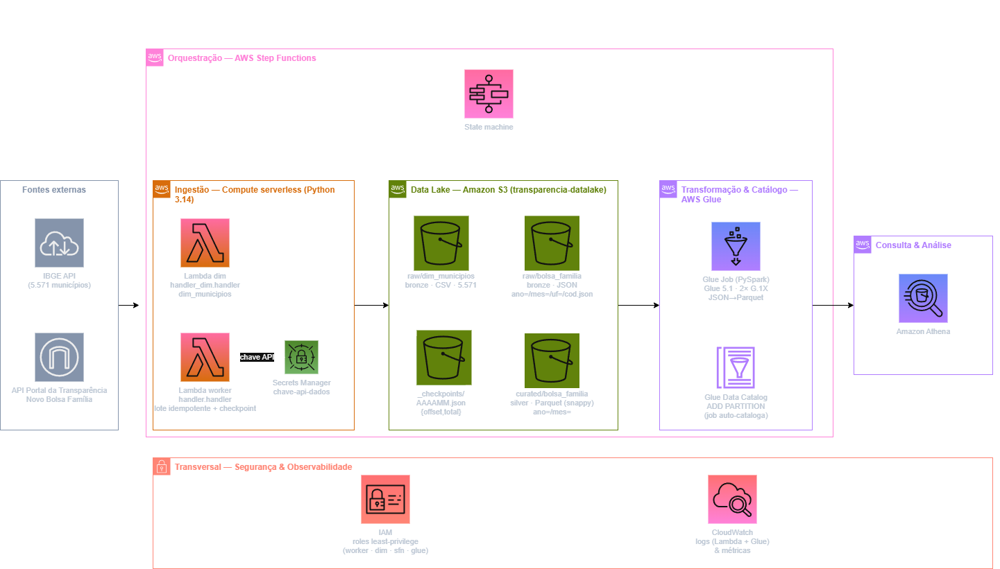

# Curso prático: Engenharia de Dados na AWS 🛠️☁️

Um **projeto educacional, mão na massa**, que ensina a construir um pipeline de dados
completo na AWS — do consumo de **API** até a análise em **SQL** — usando dados públicos
reais do **Portal da Transparência** (Novo Bolsa Família) e do **IBGE** (municípios).

> **Para quem é:** iniciantes em engenharia de dados / AWS.
> **Como funciona:** cada módulo monta uma peça da arquitetura **direto no console**
> (para você ver e entender o serviço) e validar o pipeline ponta a ponta.
> **Custo:** mantido em **centavos** — atenção: **Glue** e **Secrets Manager** **não são
> gratuitos**. Cada módulo traz o aviso de custo e a limpeza no fim para você não ser cobrado.

## O que você vai construir



Detalhes da arquitetura e glossário dos serviços em [`docs/arquitetura.md`](docs/arquitetura.md).

## Trilha de módulos

| # | Módulo | Você aprende |
|---|--------|--------------|
| 00 | [Setup AWS](modulos/00-setup-aws/README.md) | Conta, IAM, MFA, **alarme de billing**, AWS CLI |
| 01 | [As APIs e a chave](modulos/01-api-ingestao-local/README.md) | **As duas APIs (Portal da Transparência + IBGE)**, cadastro no gov.br e obtenção da chave; primeira chamada |
| 02 | [S3 / Data Lake](modulos/02-s3-data-lake/README.md) | Object storage, camadas bronze/silver, particionamento |
| 03 | [Secrets Manager](modulos/03-secrets-manager/README.md) | Guardar a chave da API com segurança (sem hardcode) |
| 04 | [Lambda — worker em lotes](modulos/04-lambda-ingestao/README.md) | Serverless, IAM role, Layer, **checkpoint, idempotência, retry 429** |
| 05 | [Glue (PySpark)](modulos/05-glue-transformacao/README.md) | ETL com Spark, achatar JSON, Parquet, partição, **catalogação pelo próprio job** |
| 06 | [Athena + Data Catalog](modulos/06-athena-analise/README.md) | Metastore (DDL), SQL serverless; **capstone: top 15 que mais/menos recebem** |
| 07 | [Step Functions](modulos/07-step-functions-orquestracao/README.md) | Orquestração: loop de lotes até fechar o mês + dispara o Glue, e **para sozinho** |
| 08 🎓 | [Desafio final — auto-check de novos meses](modulos/08-desafio-final-auto-check/README.md) | **Implementação livre:** detectar mês novo na API e disparar o pipeline sozinho (Scheduler + detector + StartExecution) |
| 09 | [Limpeza (teardown)](modulos/09-monitoramento-limpeza/README.md) | O que cobra, em que ordem remover e **teardown** completo para não gerar cobrança |

## Estrutura do repositório

```
portal-transparencia-aws/
├── README.md                     # este índice
├── docs/                         # api-limites, api-endpoints, arquitetura (+ diagrama .png)
├── modulos/                      # 00–09: um README didático por módulo
├── src/
│   ├── build_dim_municipios.py   # gera a dim (IBGE) — 5.571 municípios
│   ├── ingestao_api.py           # coletor local dos fatos (p/ entender a API)
│   └── lambda/
│       ├── handler.py            # Lambda worker (fatos, em lotes)
│       ├── handler_dim.py        # Lambda dim (municípios IBGE → S3)
│       └── requirements.txt
├── glue/job_bolsa_familia.py     # Glue PySpark: raw JSON → curated Parquet
├── stepfunctions/                # ASL da máquina de estados (orquestração)
├── iam/                          # policies de menor privilégio (worker, dim, trust)
├── sql/rankings.sql              # Athena: top 15 mais/menos (+ per capita)
├── .env / .env.example           # chave da API (NÃO versionada)
└── data/                         # local, gitignored (dim + amostras raw)
```

## Começando

1. **Pré-requisitos:** Python 3.12+ (no curso usamos **3.14**, o mesmo runtime das Lambdas),
   uma conta AWS na região **us-east-1**, e a chave da API
   ([cadastro gov.br](https://portaldatransparencia.gov.br/api-de-dados/cadastrar-email)).
2. Copie `.env.example` para `.env` e preencha sua chave.
3. Crie o ambiente local e gere a dim:
   ```bash
   python -m venv .venv
   ./.venv/Scripts/python.exe -m pip install -r src/lambda/requirements.txt
   ./.venv/Scripts/python.exe src/build_dim_municipios.py
   ./.venv/Scripts/python.exe src/ingestao_api.py --ano 2026 --mes 4 --uf SP --limite 5
   ```
4. Siga os módulos em ordem, do **00** ao **09**.

## Dados & limites da API

| Item | Valor |
|------|-------|
| Rate limit — geral (demais horários) | 400 req/min |
| Rate limit — geral (00h–06h) | 700 req/min |
| Rate limit — APIs restritas | 180 req/min |
| Estouro de limite | HTTP 429 (retry + backoff) |
| Fatos por município/mês | 1 registro (`codigoIbge` obrigatório) |

> Nosso endpoint `novo-bolsa-familia-por-municipio` é tratado como **restrito (180/min)** por
> segurança — ver [`docs/api-limites.md`](docs/api-limites.md).

Mais em [`docs/api-limites.md`](docs/api-limites.md) e [`docs/api-endpoints.md`](docs/api-endpoints.md).

## Segurança

- A chave da API **nunca** vai para o Git (`.gitignore`).
- Localmente fica no `.env`; na AWS, migra para o **Secrets Manager** (Módulo 03).
