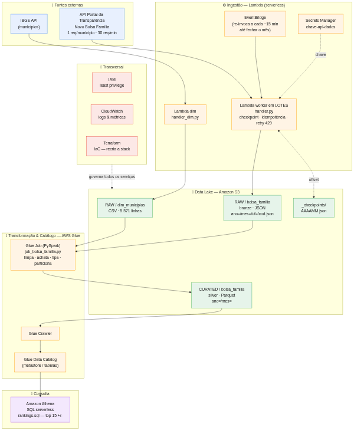
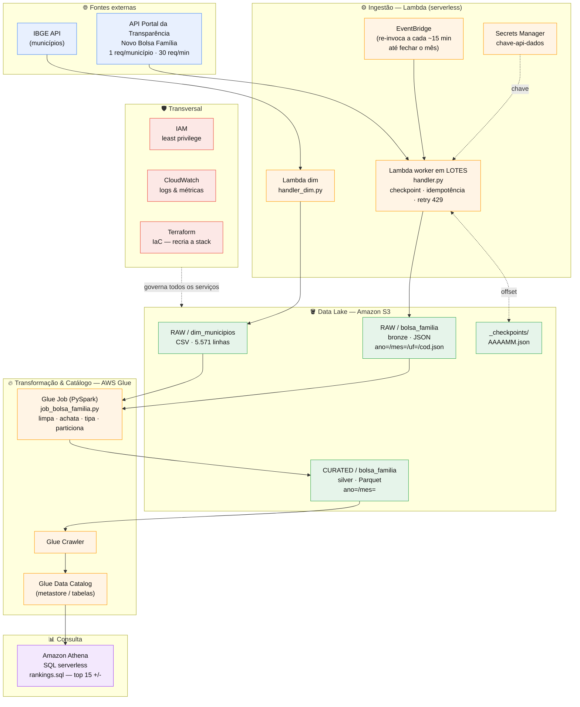

# Diagrama de arquitetura

Pipeline de dados serverless na AWS, no padrão **data lake em camadas (medallion)**.
O diagrama abaixo renderiza direto no GitHub (Mermaid). Versão em imagem: [`arquitetura.png`](arquitetura.png).

## Como ler o fluxo

1. **Fontes externas** → duas APIs públicas: IBGE (dimensão de municípios) e Portal da
   Transparência (fatos do Bolsa Família, 1 requisição por município).
2. **Ingestão (Lambda)** → a `Lambda dim` carrega os 5.571 municípios; a `Lambda worker`
   coleta os fatos **em lotes**, lendo a chave do **Secrets Manager**, salvando
   **checkpoint** no S3 e sendo re-invocada pelo **EventBridge** até fechar o mês.
3. **Data Lake (S3)** → dados crus em **RAW (bronze, JSON)**; depois tratados em
   **CURATED (silver, Parquet)**, particionados por `ano/mes`.
4. **Transformação & Catálogo (Glue)** → o **Glue Job (PySpark)** limpa e converte para
   Parquet; o **Crawler** descobre o schema e popula o **Data Catalog**.
5. **Consulta (Athena)** → SQL serverless sobre o catálogo (ranking dos 15 municípios que
   mais/menos recebem).
6. **Transversal** → **IAM** (least privilege), **CloudWatch** (observabilidade) e
   **Terraform** (recria toda a stack como código) atravessam todos os serviços.

> Detalhes de camadas, glossário de serviços e trade-offs em [`arquitetura.md`](arquitetura.md).
